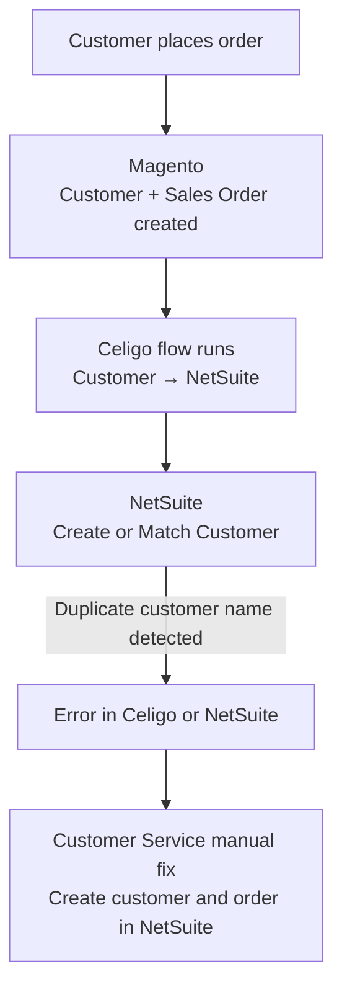
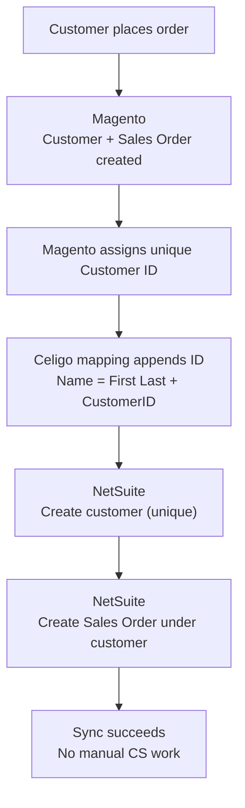
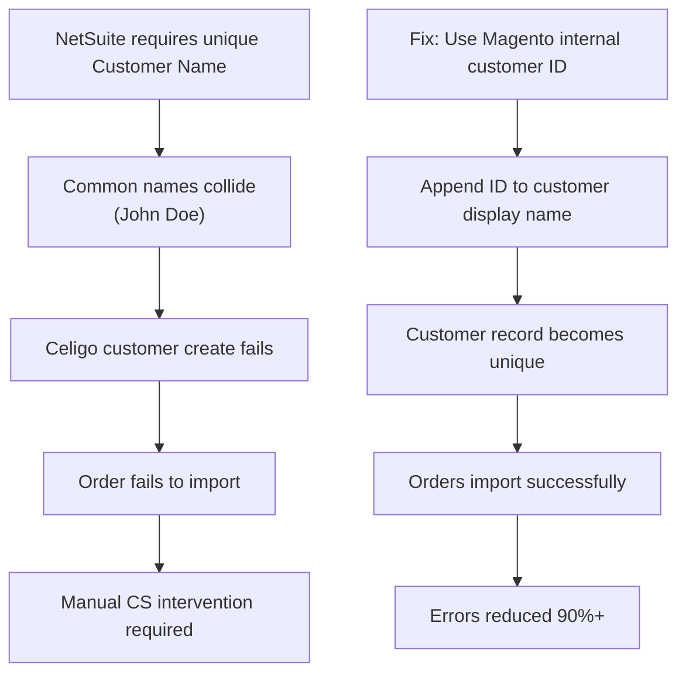

# Magento–Celigo–NetSuite Customer Mapping Optimization 👋  
**eCommerce Systems Case Study | Integration Design | Data Governance**

I’m a systems thinker who enjoys untangling complex integrations, improving operational workflows, and designing data flows that scale with real-world business growth.

This repository documents a production integration problem I worked on at **SCARPA North America**, where customer and order sync failures between **Magento, Celigo, and NetSuite** were creating significant operational overhead — and how a data-modeling–first solution reduced those errors by **90%+** without custom development.

I focus on turning fragile integrations into clean, reliable systems — the kind teams can grow on.

---

## 🧭 The Problem

SCARPA’s eCommerce stack consisted of:

- **Magento** — Frontend eCommerce platform  
- **NetSuite** — ERP & system of record  
- **Celigo (integrator.io)** — Integration layer  

### ⚠️ Core Issue
NetSuite enforces **global uniqueness on customer records**.

- Works well for wholesale
- Breaks down in **direct-to-consumer (DTC)** environments

### 📉 Impact
- Orders errored when customers shared common names (e.g. *John Doe*)
- Celigo failed during customer creation
- Orders required manual recreation in NetSuite
- Customer Service bandwidth shifted from support to data cleanup
- Payroll costs and technical debt increased

This wasn’t a bug — it was a **misalignment between system design and business model**.

---

## 🏗️ Existing Workflow (Before)

---

## 🧠 My Approach

Before applying a workaround, I focused on deeply understanding:

- Magento customer data structure  
- Celigo field availability and mappings  
- NetSuite customer uniqueness constraints  
- How CS and Sales teams actually use customer records  

Rather than forcing a system-native solution that degraded usability, I looked for a way to introduce **deterministic uniqueness** while preserving human readability.

---

## 🔑 Key Insight

Magento assigns **every customer a unique internal customer ID**.

- John Doe → Customer ID `3456`  
- John Doe → Customer ID `3459`  

This internal ID:
- Is deterministic  
- Is exposed in Magento exports  
- Is accessible inside Celigo mappings  

That made it an ideal solution for enforcing uniqueness **without sacrificing usability**.

---

## 🛠️ The Solution

We updated the Celigo customer mapping to:

- Pull Magento’s internal `customer_id`
- Append it to the customer name when creating the NetSuite record

### ✅ Resulting Format

Before: John Doe
After:  John Doe 3456

This preserved:
- Familiar customer naming conventions  
- Existing reporting and workflows  
- System-wide uniqueness in NetSuite  

No custom NetSuite development was required.

---

## 🗺️ Updated Workflow (After)

## 🔁 Broader Integration Context (Bi-Directional)

## 🧩 Root Cause → Fix Summary

---

## 📈 Results

- **90%+ reduction** in customer-related sync errors  
- Significant reduction in manual Customer Service intervention  
- Improved trust in system data  
- Lower operational overhead  
- Scalable solution aligned with DTC growth  

---

## 📦 Deliverables

- **New Celigo customer mappings**  
- **Integration logic documentation**  
- **Standard Operating Procedure (SOP)** for maintenance and troubleshooting  
- **Knowledge transfer** to Systems and Customer Service teams  

---

## 🧭 Why This Matters

This case study highlights that:

- Integration failures are often **data-modeling problems**, not tooling problems  
- Small mapping decisions can have massive operational impact  
- Systems should be designed for how people actually work — not just how software expects them to  

---

## 📁 Repository Structure

---

## 🚧 Status

This repository is part of an ongoing effort to document **real-world eCommerce integration and systems work**.

More diagrams, SOPs, and artifacts will be added incrementally.

---

> **Thanks for visiting — this repo represents how I think about systems, not just tools.**

